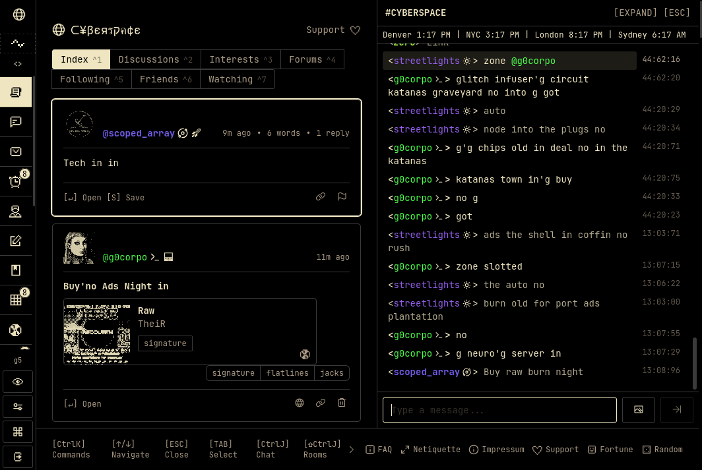
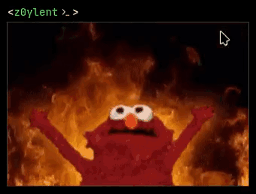

# Cyberspace Atmospheric Modulator

A custom userscript to add additional usability features to [Cyberspace.online](https://cyberspace.online) (and beta):
- Show the original un-dithered version of an image on hover/long press
- Give every username its own hashed color
- Keep personal (private) notes on people so you can remember who they are
- Add a little World Clock widget above cIRC

## Quick Start

1. Install [Tampermonkey](https://www.tampermonkey.net/) or [Greasemonkey](https://www.greasespot.net/)
2. Open [cyberspace-atmospheric-modulator.user.js](https://raw.githubusercontent.com/z0mbieparade/cyberspace-atmospheric-modulator/refs/heads/main/cyberspace-atmospheric-modulator.user.js) and choose **Install**.
3. Reload Cyberspace.

**Coming from the Nick Colors userscript? Check the wiki to see how to move your settings over.**

Settings are in the site's **Settings > AtmoMod** tab. Access them via **Settings** page or via the little modulator icon under the globe in the sidebar.

**Warning:** report problems to [@z0ylent](https://cyberspace.online/z0ylent), not to Cyberspace's creator. This is an unofficial script.

## Documentation

See the wiki for more info.

## License

[GNU General Public License v3.0 or later](LICENSE)

## Contact

- Email: hey@z0m.bi
- Cyberspace: [@z0ylent](https://cyberspace.online/z0ylent)

